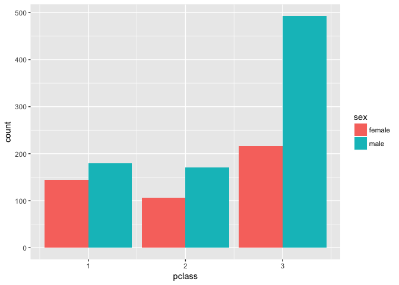
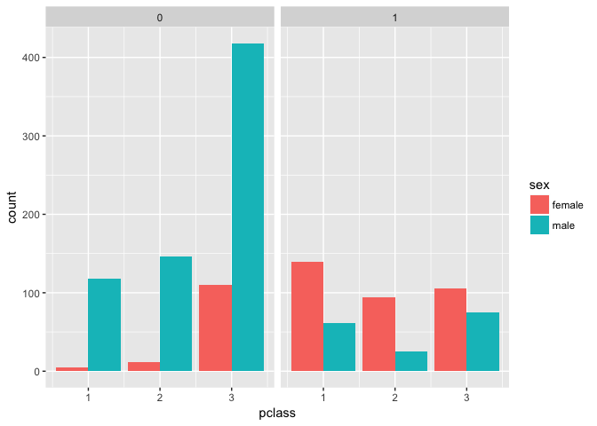
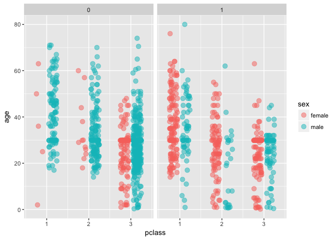

Titanic
================

Titanic exercise
----------------

#### Prashaanth Jagannathan

#### Load the titanic\_clean.csv from Project-2

``` r
data_dir <- "/Users/jeevarehakrishnaraj/Desktop/Springboard/Project 3"
titanic <- read.csv(file.path(data_dir,"titanic_clean.csv"))
```

Load the required packages

``` r
library(dplyr)
```

    ## Warning: package 'dplyr' was built under R version 3.4.2

    ## 
    ## Attaching package: 'dplyr'

    ## The following objects are masked from 'package:stats':
    ## 
    ##     filter, lag

    ## The following objects are masked from 'package:base':
    ## 
    ##     intersect, setdiff, setequal, union

``` r
library(ggplot2)
library(magrittr)
library(tidyr)
```

    ## Warning: package 'tidyr' was built under R version 3.4.1

    ## 
    ## Attaching package: 'tidyr'

    ## The following object is masked from 'package:magrittr':
    ## 
    ##     extract

#### 1 - Check the structure of titanic

``` r
str(titanic)
```

    ## 'data.frame':    1310 obs. of  15 variables:
    ##  $ pclass          : int  1 1 1 1 1 1 1 1 1 1 ...
    ##  $ survived        : int  1 1 0 0 0 1 1 0 1 0 ...
    ##  $ name            : Factor w/ 1308 levels "","Abbing, Mr. Anthony",..: 23 25 26 27 28 32 47 48 52 56 ...
    ##  $ sex             : Factor w/ 3 levels "","female","male": 2 3 2 3 2 3 2 3 2 3 ...
    ##  $ age             : num  29 0.917 2 30 25 ...
    ##  $ sibsp           : int  0 1 1 1 1 0 1 0 2 0 ...
    ##  $ parch           : int  0 2 2 2 2 0 0 0 0 0 ...
    ##  $ ticket          : Factor w/ 930 levels "","110152","110413",..: 189 51 51 51 51 126 94 17 78 827 ...
    ##  $ fare            : num  211 152 152 152 152 ...
    ##  $ cabin           : Factor w/ 187 levels "","A10","A11",..: 45 81 81 81 81 151 147 17 63 1 ...
    ##  $ embarked        : Factor w/ 3 levels "C","Q","S": 3 3 3 3 3 3 3 3 3 1 ...
    ##  $ boat            : Factor w/ 28 levels "10","11","12",..: 4 22 28 28 28 5 21 28 20 28 ...
    ##  $ body            : int  NA NA NA 135 NA NA NA NA NA 22 ...
    ##  $ home.dest       : Factor w/ 370 levels "","?Havana, Cuba",..: 310 232 232 232 232 238 163 25 23 230 ...
    ##  $ has_cabin_number: int  1 1 1 1 1 1 1 1 1 0 ...

##### The passenger with missing information is excluded from the dataset

``` r
titanic <- titanic %>% mutate(name = ifelse(name == '','Missing',name))

# Filter out the missing row from the dataset 
titanic <- filter(titanic,name != 'Missing')
```

#### 2 - Plotting the distribution of sexes within the classes of the ship.

``` r
ggplot(titanic, aes(x = pclass, fill =sex)) +
  geom_bar(position = 'dodge')
```



#### 3 - Estimate the chances of survival from the distribution of sexes within the classes of the ship.

``` r
ggplot(titanic, aes(x = pclass, fill = sex)) +
  geom_bar(position = 'dodge')+
  facet_grid(".~ survived")
```

 \#\#\#\# 4 - Define an object for position jitterdodge, to use below

``` r
posn.jd <- position_jitterdodge(0.5, 0, 0.6)
```

#### 5 - Estimate the chances of survival based on your age from the distribution of sexes within the classes of the ship.

``` r
ggplot(titanic, aes(x = pclass, y = age, col = sex)) +
  geom_jitter(size = 3, alpha = 0.5, position = posn.jd) +
  facet_grid(". ~ survived")
```


